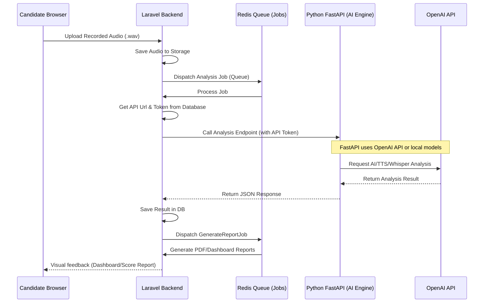

# SpeechIQ API Documentation

This document describes the API interface between the Laravel backend and the Python FastAPI AI Engine, as well as the internal details of how configuration settings (like API keys) are managed dynamically in SpeechIQ.

---

## 1. System Architecture Overview

SpeechIQ uses an **API-First Architecture** between the Laravel 12 application and the Python FastAPI AI Engine. 
- **Laravel** handles the user interface, candidate dashboards, audio recording uploads, database migrations, scheduling, queues, and report generation.
- **Python FastAPI** serves as the AI Engine, running audio transcription (STT), text-to-speech (TTS), pronunciation/fluency analysis, and interview question/feedback generation.
- All AI Engine endpoints are configured dynamically. **No API keys or AI URLs are hardcoded** in `.env` files. Instead, they are retrieved from the `settings` database table using the global helper function `setting()`.



---

## 2. Global Settings Configuration

API keys, endpoints, and features toggles are stored securely in the `settings` table. Admin can configure these keys manually from the **Admin settings panel** (`/admin/settings`).

### Settings Table Structure

| Column Name | Type | Description |
| :--- | :--- | :--- |
| `id` | BigInt (PK) | Auto-increment unique identifier. |
| `setting_key` | String (Unique) | Config key (e.g., `OPENAI_API_KEY`, `AI_API_URL`). |
| `setting_value` | Text (Nullable) | The actual value. Encrypted if `is_encrypted` is `true`. |
| `setting_type` | String | Type of setting: `text`, `boolean`, `password`. |
| `is_encrypted` | Boolean | True if the value is encrypted using Laravel's Crypt system. |

### Required Settings Keys

1. `OPENAI_API_KEY`: Secret API key for OpenAI integrations. Saved securely and masked in the UI.
2. `OPENAI_MODEL`: GPT model to use for generating interview questions/feedback (default: `gpt-4o-mini`).
3. `OPENAI_TTS_MODEL`: Model used for Text-to-Speech synthesis (default: `tts-1`).
4. `OPENAI_TRANSCRIBE_MODEL`: Model used for Whisper voice transcription (default: `whisper-1`).
5. `AI_API_URL`: Base URL of the Python FastAPI server (default: `http://127.0.0.1:8001`).
6. `AI_API_TOKEN`: Access Token (Bearer Token) for authentication against the FastAPI AI server.
7. `ENABLE_AI_INTERVIEW`: Feature toggle for conversational mock interviews.
8. `ENABLE_READ_ALOUD`: Feature toggle for read-aloud pronunciation assessments.
9. `ENABLE_TTS`: Feature toggle for Text-To-Speech features.
10. `ENABLE_STT`: Feature toggle for Speech-To-Text features.

---

## 3. API Endpoints Reference

All requests to the FastAPI Python engine must be authenticated. If `AI_API_TOKEN` is configured, it is sent in the request header as:
`Authorization: Bearer <AI_API_TOKEN>`

### 3.1. Health Check
Checks if the Python FastAPI server is up, running, and accessible with its features.

- **Route:** `POST /health-check`
- **Headers:** 
  - `Accept: application/json`
- **Request Body (DTO):** None
- **Response Format (DTO):**
```json
{
  "status": "healthy",
  "service": "speechiq-ai-engine",
  "features": {
    "stt": true,
    "tts": true,
    "analysis": true
  }
}
```

---

### 3.2. Read Aloud Analysis
Analyzes the pronunciation, fluency, and accuracy of a candidate's reading against a target paragraph.

- **Route:** `POST /read-aloud-analyze`
- **Request Format:** Multipart Form Data (`multipart/form-data`)
- **Headers:**
  - `Accept: application/json`
- **Request Parameters (DTO):**

| Parameter | Type | Required | Description |
| :--- | :--- | :--- | :--- |
| `audio_file` | Binary | Yes | Recorded audio file in WAV/MP3 format. |
| `target_text` | String | Yes | The exact paragraph text the user was asked to read aloud. |

- **Response Format (DTO):**

| Field | Type | Description |
| :--- | :--- | :--- |
| `transcript` | String | The transcribed text parsed from candidate's audio. |
| `pronunciation_score` | Integer (0-100) | Metric representing clarity of sound phonemes. |
| `fluency_score` | Integer (0-100) | Pacing and smoothness score. |
| `accuracy_score` | Integer (0-100) | Match rate between transcript and target text. |
| `overall_score` | Integer (0-100) | Average composite score of pronunciation, fluency, and accuracy. |
| `wpm` | Integer | Words Per Minute spoken. |
| `pause_count` | Integer | Total number of significant pauses detected. |
| `pause_duration` | Float | Total length of pauses in seconds. |
| `missing_words` | Array of strings | Words present in target text but skipped by candidate (in lowercase). |
| `extra_words` | Array of strings | Filler words spoken by candidate but not in target text (e.g. "um", "ah"). |
| `accent` | String | Classified accent profile (e.g. "Indian Accent", "US Accent"). |

- **Example JSON Response:**
```json
{
  "transcript": "Hello world this is a test audio response.",
  "pronunciation_score": 88,
  "fluency_score": 82,
  "accuracy_score": 95,
  "overall_score": 88,
  "wpm": 135,
  "pause_count": 2,
  "pause_duration": 1.45,
  "missing_words": ["beautiful"],
  "extra_words": ["um"],
  "accent": "Indian Accent"
}
```

---

### 3.3. Speech To Text (STT)
Transcribes voice recording to English text without specific comparison.

- **Route:** `POST /speech-to-text`
- **Request Format:** Multipart Form Data (`multipart/form-data`)
- **Headers:**
  - `Accept: application/json`
- **Request Parameters (DTO):**

| Parameter | Type | Required | Description |
| :--- | :--- | :--- | :--- |
| `audio_file` | Binary | Yes | Recorded audio file. |

- **Response Format (DTO):**
```json
{
  "text": "This is a mock transcribed response from the candidate discussing their technical experience and system architecture preferences."
}
```

---

### 3.4. Interview Analysis
Analyzes candidate's verbal response to a structured interview question, assessing grammatical accuracy, vocabulary breadth, relevance of content, confidence, and pronunciation.

- **Route:** `POST /interview-analyze`
- **Request Format:** Multipart Form Data (`multipart/form-data`)
- **Headers:**
  - `Accept: application/json`
- **Request Parameters (DTO):**

| Parameter | Type | Required | Description |
| :--- | :--- | :--- | :--- |
| `audio_file` | Binary | Yes | Recorded answer audio file. |
| `question` | String | Yes | The text of the question asked. |

- **Response Format (DTO):**

| Field | Type | Description |
| :--- | :--- | :--- |
| `question` | String | The original question text. |
| `transcript` | String | Transcribed audio textual answer. |
| `grammar_score` | Integer (0-100) | Score evaluating structural correctness of speech. |
| `vocabulary_score` | Integer (0-100) | Score measuring vocabulary range and appropriate terminology. |
| `content_score` | Integer (0-100) | Relevance score answering the prompt directly. |
| `confidence_score` | Integer (0-100) | Calculated confidence based on pacing and speech pitch dynamics. |
| `pronunciation_score` | Integer (0-100) | Clarity of pronunciation of vocabulary. |
| `fluency_score` | Integer (0-100) | Pacing, hesitation frequency, and silence rates. |
| `accent` | String | Detected accent profile classification. |
| `overall_score` | Integer (0-100) | Average composite score of grammar, vocabulary, content, confidence, pronunciation, and fluency. |
| `feedback` | String | Qualitative AI feedback detailing positive points and areas for growth. |

- **Example JSON Response:**
```json
{
  "question": "How do you design database schemas to optimize query performance in a heavy-traffic web app?",
  "transcript": "In my previous project, I designed a microservices architecture using Laravel and RabbitMQ to process asynchronous events efficiently.",
  "grammar_score": 92,
  "vocabulary_score": 85,
  "content_score": 90,
  "confidence_score": 95,
  "pronunciation_score": 87,
  "fluency_score": 89,
  "accent": "US Accent",
  "overall_score": 89,
  "feedback": "Your response to 'How do you design database schemas...' was articulate and structured. Vocabulary usage was strong with good domain-specific terms. Pronunciation was mostly accurate, though pacing could be improved slightly to sound more relaxed. Grammatical structure was sound, and confidence levels reflected expertise."
}
```

---

### 3.5. Generate Next Question
Generates the next contextual question in an interview flow based on the test parameters and the previous chat history.

- **Route:** `POST /generate-question`
- **Request Format:** Application JSON (`application/json`)
- **Headers:**
  - `Accept: application/json`
  - `Content-Type: application/json`
- **Request Parameters (DTO):**

| Parameter | Type | Required | Description |
| :--- | :--- | :--- | :--- |
| `context` | String | Yes | Context/Prompt parameters of the interview (e.g. "Software developer role candidate"). |
| `history` | Array | No | List of previous dialog exchanges representing the conversation context so far. |

- **Example JSON Request:**
```json
{
  "context": "Technical Laravel Interview focusing on background jobs and SQL optimization",
  "history": [
    {
      "role": "assistant",
      "content": "To begin the interview, could you tell me about yourself and your primary technical stack?"
    },
    {
      "role": "user",
      "content": "I am a full stack developer with 3 years of experience in PHP, Laravel 12, MySQL, and Redis."
    }
  ]
}
```

- **Response Format (DTO):**
```json
{
  "question": "That sounds impressive. How do you approach scaling applications and handling load spikes?"
}
```

---

### 3.6. Generate Feedback
Generates overall summative feedback for the candidate when an interview is finished.

- **Route:** `POST /generate-feedback`
- **Request Format:** Application JSON (`application/json`)
- **Headers:**
  - `Accept: application/json`
  - `Content-Type: application/json`
- **Request Parameters (DTO):**

| Parameter | Type | Required | Description |
| :--- | :--- | :--- | :--- |
| `question` | String | Yes | Interview title or major question discussed. |
| `transcript` | String | Yes | The combined transcripts of all candidate answers. |

- **Example JSON Request:**
```json
{
  "question": "Senior PHP Developer Candidate Evaluation",
  "transcript": "My main backend experience is PHP 8.3 and Laravel 12 frameworks. I focus on optimizing database queries and deploying workers."
}
```

- **Response Format (DTO):**
```json
{
  "feedback": "Overall performance was exceptional. The vocabulary aligns closely with senior developer requirements, grammar metrics are sound, and core software design knowledge was clearly demonstrated."
}
```

---

### 3.7. Text to Speech (TTS)
Converts text prompts into playable synthetic audio files.

- **Route:** `POST /text-to-speech`
- **Request Format:** Application JSON (`application/json`)
- **Headers:**
  - `Accept: application/json`
  - `Content-Type: application/json`
- **Request Parameters (DTO):**

| Parameter | Type | Required | Description |
| :--- | :--- | :--- | :--- |
| `text` | String | Yes | The text message prompt to synthesize into audio. |

- **Example JSON Request:**
```json
{
  "text": "Welcome to SpeechIQ. Let us assess your communication capabilities."
}
```

- **Response Format (DTO):**
```json
{
  "audio_url": "/mock-audio/synthetic_speech.mp3"
}
```

---

## 4. Swagger Documentation

The Python FastAPI backend automatically auto-generates Interactive OpenAPI Swagger docs.

- **FastAPI OpenAPI Schema (JSON):** `/openapi.json`
- **Interactive Swagger UI:** `/docs`
- **Alternative ReDoc UI:** `/redoc`

Whenever the FastAPI server is running on `127.0.0.1:8001`, you can navigate directly to:
**[http://127.0.0.1:8001/docs](http://127.0.0.1:8001/docs)**
to see the live endpoints interface, check model definitions (Schemas), download JSON structures, and perform direct mock test requests.

---

## 5. Security & Encryption Details

For security compliance:
1. **API Keys Encryption:** The `Setting` model automatically intercepts keys when updating. If `is_encrypted` is set to `true`, the value is encrypted using `Crypt::encryptString()` and decrypted using `Crypt::decryptString()` upon retrieval.
2. **API Access Control:** The FastAPI server checks for the `Authorization: Bearer <Token>` header matching the value set in Settings. Any unauthorized request will be rejected to protect the server resources.
3. **Queue Sanitization:** All files submitted to queue analysis jobs are processed inside decoupled background threads to prevent web server resource exhaustion.
